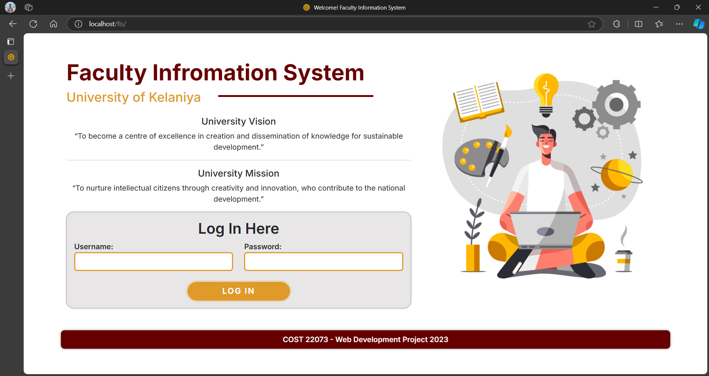
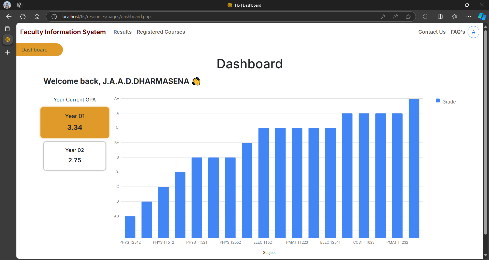
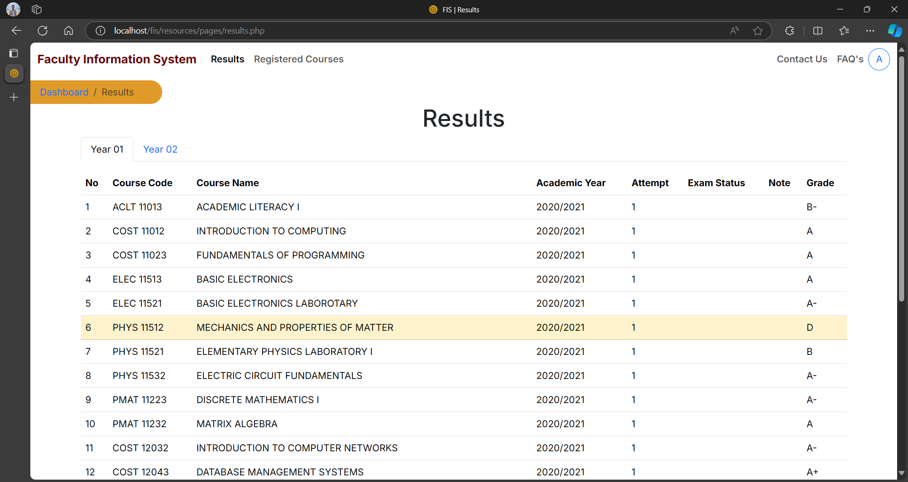
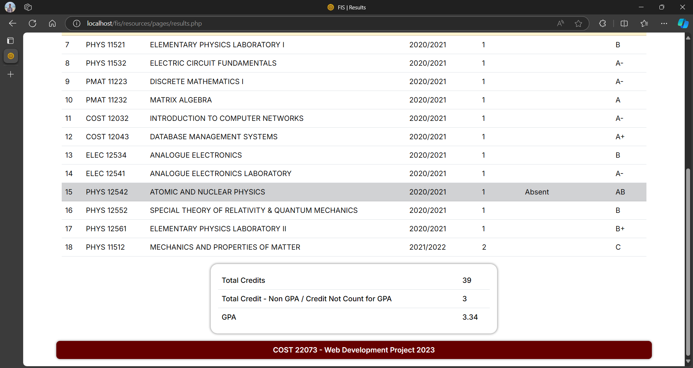
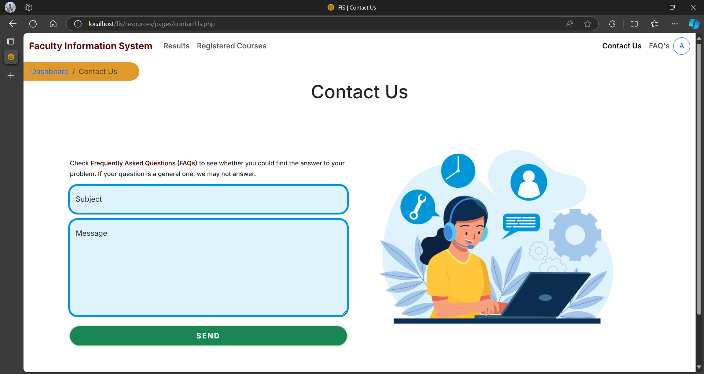
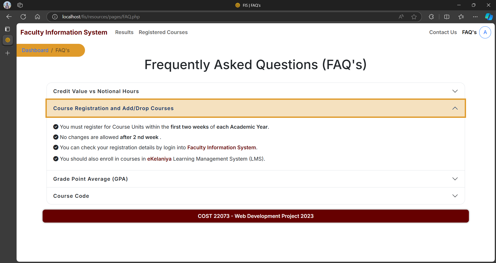
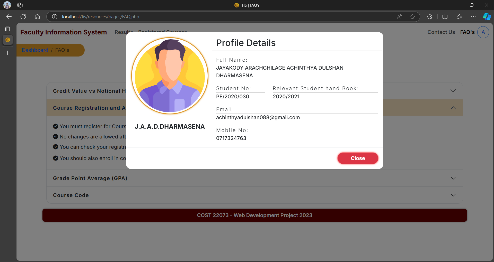

# Faculty Management System using php and mySQL

This one is our final project of the course module **COST 22073 - Web Development** which is offered in 2nd year 2nd semester. This project is based on Faculty Information System of university and that is addressed most of the problems which are faced by users in current Faculty Information System.

## Table of contents

- [Overview](#overview)
  - [Functionalities](#functionalities)
  - [Screenshot](#screenshot)
- [My process](#my-process)
  - [Built with](#built-with)
- [Author](#author)

## Overview

### functionalities

- Login with credentials (username and password)
- View summary of currently available results on the dashboard
- View results and relevant information based on year separately
- View registered courses based on year separately
- Contact the admin through the "Contact Us" section via email
- Access frequently asked questions in the FAQ section for quick assistance
- View profile information
- Include necessary validations

> [!NOTE]
> Above functionalities are main functionalities

### Screenshot - Log in

### Screenshot - Dashboard

### Screenshot - View Result - 1

### Screenshot - View Result - 2

### Screenshot - Contact Us

### Screenshot - FAQ section

### Screenshot - Profile details

## My process

### Built with

- [php](https://www.php.net/)
- Semantic HTML5 markup
- [Bootstrap 5.3.2](https://getbootstrap.com/)
- [mySQL database](https://www.mysql.com/)
- [JQuery](https://jquery.com/)
- [fontawesome 6.4.2](https://fontawesome.com/)
- [PHPMailer 6.9.1](https://github.com/PHPMailer/PHPMailer)
- [Apache](https://httpd.apache.org/)
- [XAMPP](https://www.apachefriends.org/)
- Custom css & js
- Desktop-first workflow

## Author

<!-- - Website - [Add your name here](https://www.your-site.com) -->

- Frontend Mentor - [@AchinthyaDulshan](https://www.frontendmentor.io/profile/AchinthyaDulshan)
- LinkedIn - [Achinthya Dulshan](https://www.linkedin.com/in/achinthya-dulshan-6a0616221/)
- X - [@Achi_Dulshan](https://x.com/Achi_Dulshan)
